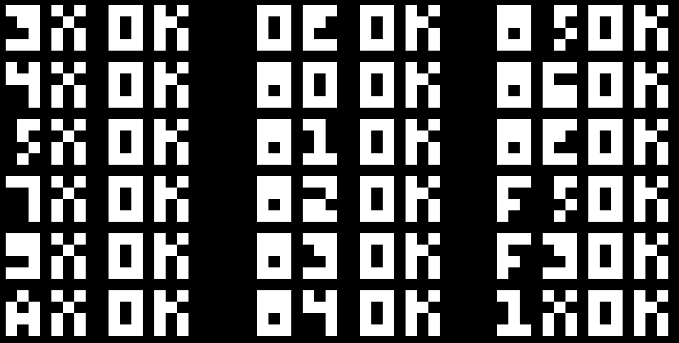

## Single File CHIP-8 Emulator
A very fast CHIP-8 written in less than 500 source lines of C code.

## Requirements
- [gcc](https://gcc.gnu.org/)
- [make](https://www.gnu.org/software/make/)
- [SDL](https://www.libsdl.org/)

## Quickstart
First `make` the emulator:
```bash
$ make
```

Then run it by passing it a CHIP-8 ROM from the command line, i.e.
```bash
$ ./chip8 <ROM>
```
where \<ROM\> is the path to a CHIP-8 ROM.

## Testing
```bash
$ make test
```

You should see this if all the tests are passing:


## Acknowledgments and References
- Thanks to Cowgod for making the first (as far as I know) publicly available [technical reference](http://devernay.free.fr/hacks/chip8/C8TECH10.HTM)
- I also referred to [James Griffin's implementation](https://github.com/JamesGriffin/CHIP-8-Emulator/) a few times for checking my implementation of some of the more ambiguous instructions (e.g, `Fx55` and `Fx65`)
- Finally, corax89's CHIP-8 [test rom](https://github.com/corax89/chip8-test-rom) made it easy (read: possible) to test my emulator
